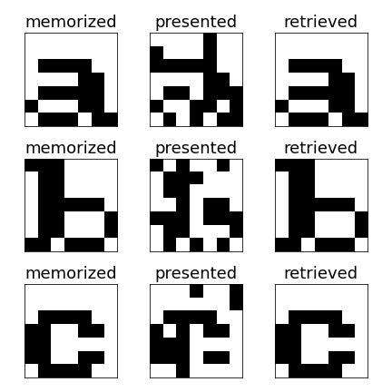
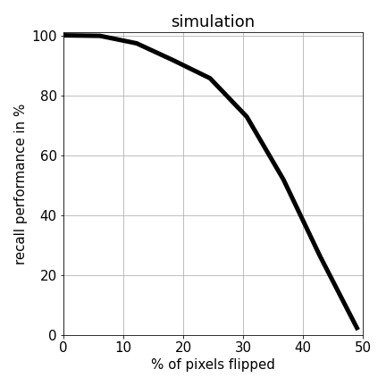

# Hopfield network (1982)

## Hopfield network for content-addressable memory (CAM)

### Table of Contents

- [Images](#images)
- [Description](#description)
- [Keywords](#keywords)
- [How to Use](#how-to-use)
- [References](#references)
- [Author Info](#author-info)

## Images

## Description

"Hopfield network for content-addressable memory (CAM)."

#### Technologies

- Python programming language

## Keywords

 - Associative memory
 - Storage phase
 - Recall phase
 - Sum of outer products
 - Asynchronous update rule
 - Bipolar input patterns
 - Symmetric weights
 - Signum activation function

## How to Use

#### Getting started

`git clone https://github.com/berberianareg/Hopfield.git`

#### Dependencies

see requirements.txt

#### Installation

`pip install numpy`

`pip install matplotlib`

#### Executing the program from command line

`python Hopfield.py`

## References

#### Links

- Relevant paper - (https://www.pnas.org/doi/abs/10.1073/pnas.79.8.2554)

## Author Info

- Twitter - [@berberianareg](https://twitter.com/BerberianNareg)
- LinkedIn - [Nareg Berberian](https://www.linkedin.com/in/nareg-berberian-phd-ab6759b9/)

[Back to the Top](#hopfield-network-1982)

